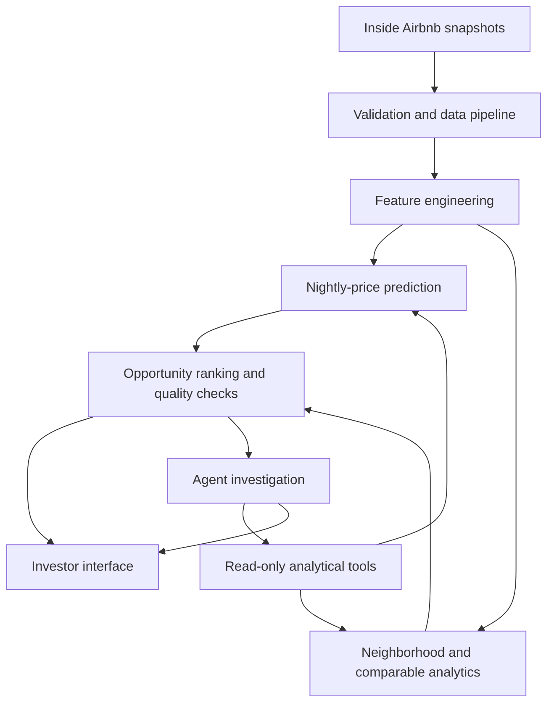

# Property Investment Intelligence System

BIU DS23 final project by **Erin Schaverien, Ron Ness, Idan Gilad and Adir Libovitch**.

## Purpose and status

Help short-term-rental investors identify listings and neighborhoods worth further investigation through predictive modelling, market analytics and evidence-grounded agent investigations.

**Status: repository scaffold and planning documents.** No data pipeline, trained model, agent or dashboard is implemented yet. Notebooks are work templates with no results.

The uploaded Project Charter defines Inside Airbnb as the primary source and Zillow Research as Plan B. The working document also describes an earlier Zillow-led market scope. This repository follows the charter's Airbnb scope. Acquisition value and ROI cannot be inferred from nightly listing prices.

## Architecture



The agent selects investigations, compares contextual evidence and explains contradictions. Cleaning, financial arithmetic, filtering, feature preparation, prediction and ranking remain in deterministic code. Investors can inspect analytical outputs when the agent is unavailable.

## Team

| Responsibility | Owner |
| --- | --- |
| Data and features | Erin Schaverien |
| Models and quantitative evaluation | Idan Gilad |
| Agent, tools and guardrails | Adir Libovitch |
| Product, architecture and investor output | Ron Ness |

Everyone contributes code and presents.

## Repository map

| Path | Contents |
| --- | --- |
| `CHARTER.md` | Business problem, scope, proposed metrics, risks and milestones |
| `data/raw/`, `data/processed/` | Local datasets, excluded from Git |
| `data/data_dictionary.md` | Planned schema; replace with inspected source schema |
| `data/sources.md` | Source provenance and acquisition checklist |
| `notebooks/` | Ordered EDA, preprocessing, modelling, evaluation and experiments |
| `src/` | Reusable ingestion, features, models, analytics and application code |
| `agents/` | Decision loop, tools, prompts and guardrails |
| `evaluation/` | Frozen evaluation cases, groundedness and error analysis |
| `models/` | Local model artifacts and version metadata |
| `reports/` | Baseline comparisons, results and figures |
| `presentation/` | Final presentation and demo backup |
| `docs/` | Architecture decisions and delivery plan |
| `tests/` | Future meaningful pipeline, calculation and tool-contract tests |

## Environment and working order

Use Python 3.11 as the proposed team baseline. The environment and dependencies must be verified before the first pipeline checkpoint.

```bash
git clone https://github.com/roness3yn/property-investment-intelligence-system.git
cd property-investment-intelligence-system
python3 -m venv .venv
source .venv/bin/activate
python -m pip install -r requirements.txt
```

On Windows PowerShell, activate with `.venv\Scripts\Activate.ps1`.

`requirements.txt` intentionally contains no dependencies yet: library versions must be chosen and pinned when implementation starts. Installing it does not make the application runnable. Start by acquiring one city snapshot, recording its provenance, completing the dictionary and then implementing notebooks 01–04 using reusable `src/` functions. Choose the dashboard and LLM provider later.

## Data and reproducibility

Primary source: [Inside Airbnb](https://insideairbnb.com/get-the-data/).
Fallback: [Zillow Research](https://www.zillow.com/research/data/).

The charter reports approximately 1.5 million listings across 153 CSV files and roughly 12 months of coverage. These are planning figures, not counts verified by this repository. Record city, source URL, download date, snapshot date, row counts, units, license and checksum in `data/sources.md`. Begin with one city and one currency.

Do not commit large datasets, credentials, host personal details or trained binary artifacts. Use local ignored directories or controlled external storage; document reproducible download steps. Record transformations and missing-value handling in the dictionary. Keep duplicate listing identities across snapshots out of both sides of the evaluation split, and fit preprocessing only on training data.

## Evaluation and cheaper baseline

All alternatives must use the same held-out cases and split. Values are pending implementation.

| Approach | MAE in selected city's currency/night | RMSE | Response time | Cost/query |
| --- | --- | --- | --- | --- |
| Training-set median by neighborhood and room type, global-median fallback | Not measured | Not measured | Not measured | Not measured |
| Learned nightly-price model | Not measured | Not measured | Not measured | Not measured |
| Deterministic analytical report without agent | N/A | N/A | Not measured | Not measured |
| Agent investigation of the same opportunities | N/A | N/A | Not measured | Not measured |

Proposed targets and the evaluation design are in `CHARTER.md` and `evaluation/README.md`. Report model error, groundedness, failed tool calls, uncertainty, and whether the extra agent cost produces useful evidence.

## Guardrails

- Availability is not confirmed occupancy or bookings.
- Nightly asking price is not acquisition value or realized revenue.
- Compute ROI only with explicit acquisition and operating-cost inputs.
- Ground claims in tool outputs with source dates and evidence identifiers.
- Return insufficient evidence when data is missing or contradictory.
- The product supports investigation; it does not issue buy/no-buy instructions.

## Course deadlines

Charter: **4 October 2026**. Recommended pipeline checkpoint: **18 October**.
Recommended agent checkpoint: **30 October**. Pre-mentoring repository freeze: **1 November**.
Mentoring: **4 November**. Final slides and repository freeze: **12 November**.
Presentations: **15 or 18 November**, subject to team allocation.

See [CHARTER.md](CHARTER.md) and [delivery plan](docs/delivery-plan.md).

## Contributions

Work in short feature branches, open a pull request and describe the behavior and verification. Use issues to track ownership and acceptance criteria. See [CONTRIBUTING.md](CONTRIBUTING.md).

